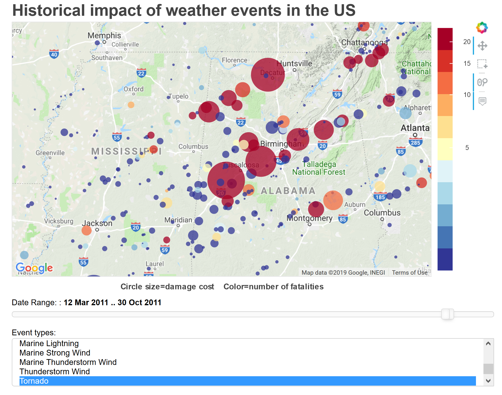

# NOAA StormEvent historical weather event data

For our April 2018 Applied Data Science meetup series, member Johnathan Mackrory prepared a dataset from NOAA historical weather event data:

> This looks at the StormEvent data. The data starts in 1950, and runs till today. As discussed on the webpage(https://www.ncdc.noaa.gov/stormevents/details.jsp), the amount of information tracked has changed over time. In the 50s only tornados were tracked, and was expanded to thunderstorms and hail in the 60s. The full panoply of events only started being collected in 1996. So around 20 years of "full" coverage.

- The data used in these notebooks runs about 232 MB. [I've provided a zipped version on my project github page](https://github.com/johnmburt/projects/tree/master/NOAA_weather_events/detail_trim1.zip). To use it, just unzip the data into the same folder as this notebook.

# Projects:

## Graphing the total yearly cost of weather events from 1950 to 2017

A bar chart showing the total inflation adjusted cost of recorded weather events throughout the years in the dataset.

- [JMB_storm_data_cost_vf.ipynb](http://nbviewer.jupyter.org/github/johnmburt/projects/blob/master/NOAA_weather_events/JMB_storm_data_cost_vf.ipynb)

## Interactive map with weather event overlay 

My goal for this project was to create an interactive map plot allowing users to visualize the impact of selected weather events over space and time. The plot has a list selector for users to select different weather event types to plot, and a date slider so that they can select the time range to view. 

The visualization was generated using the interactive graphing package bokeh.

- [NOAA_weather_events/weather_map_bokeh_googlemaps_app_vf.ipynb](http://nbviewer.jupyter.org/github/johnmburt/projects/blob/master/NOAA_weather_events/weather_map_bokeh_googlemaps_app_vf.ipynb)

### Map at interactive session startup:

### Map zoomed in and date selected to show the 4/27/2011 tornado "Super Outbreak".

