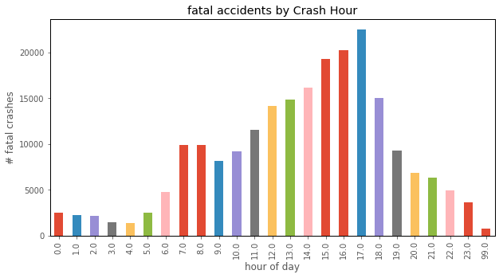
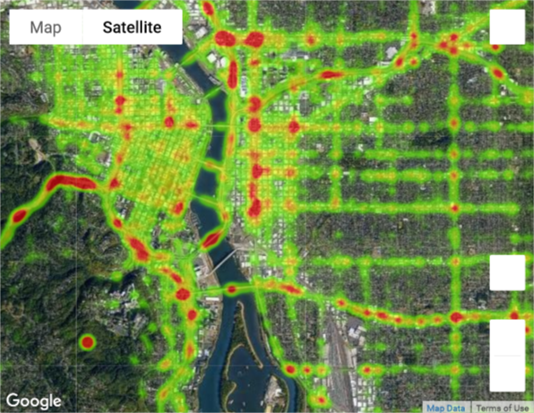

## ODOT 2003 - 2015 crash data

This is a dataset from the Oregon Department of Transporation that details all crashes reported in a given year. The data is very rich, with many interesting fields. For this project, I explored two visual analyses: 

### Notebooks:
- **Crash rates vs day and time-of-day.** 

- **An interactive heat map** * showing crash densities throughout the regions that crashes were reported.

*To see the heatmap, you will need to run the notebook.
