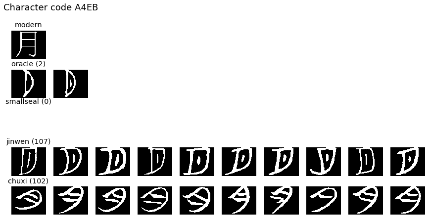
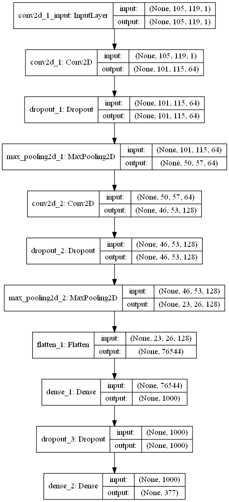

# Ancient Chinese character images

The Chinese character data used in this notebook was provided to participants in the December 2018 Applied Data Science meetup series. From the meetup intro:

>Our data for November and December is a simple entry point to image analysis: automated recognition of historical, handwritten, Chinese characters, some of which may date back to over 3,000 years ago.

An unlabelled holdout dataset was provided as a challenge to those who wanted to build a classifier to predict their character code and/or era.

## Projects:

### Reading the images, parsing metadata, visualizing characters

- [JMB_chinese_char_evolution_load_vf.ipynb](http://nbviewer.jupyter.org/github/johnmburt/projects/blob/master/chinese_characters/JMB_chinese_char_evolution_load_vf.ipynb)

### CNN based character code classifier.

- [JMB_chinese_char_evolution_CNN_char_prediction_f.ipynb](http://nbviewer.jupyter.org/github/johnmburt/projects/blob/master/chinese_characters/JMB_chinese_char_evolution_CNN_char_prediction_f.ipynb)

#### CNN model used for the classifier:

