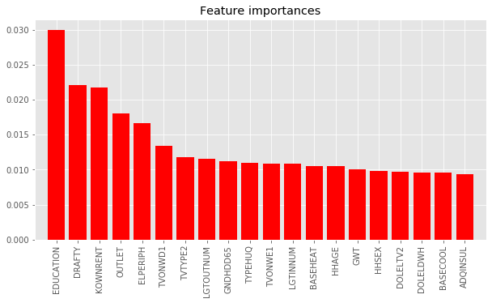

# Residential Energy Consumption Survey (RECS)

The Residential Energy Consumption Survey was conducted in 2017 by the U.S. Energy Information Administration (EIA). The survey asked an enormous number of questions about energy consumption, building features, appliances used, and economic and other demographic information about the home occupants.

I chose to examine what factors in residential life, appliances, home construction and occupant demographics are associated with financial hardship? Knowing what factors predict poverty can help agencies identify people who may need extra help. Similarly, struggling people may be better helped by targeted upgrade assistance for obsolete appliances they're likely to own.

## Projects:

### Using trained XGBoost classifier feature importances to examine the most important features predicting economic hardship.
- [ODOT_crash_feature_analyses_vf.ipynb](http://nbviewer.jupyter.org/github/johnmburt/projects/blob/master/residential_energy_use/RECS_feature_importances_XGB_vf.ipynb)

